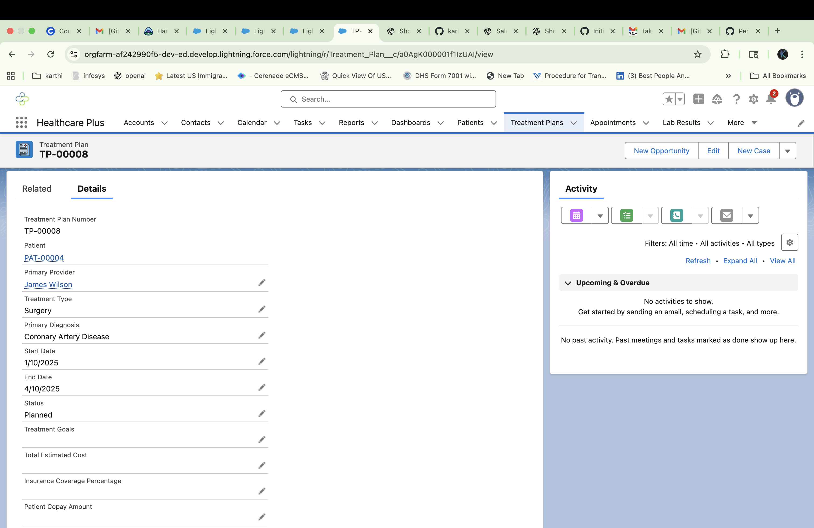

# 🏥 Healthcare Plus — Salesforce Admin Project

## 📌 Overview
Healthcare Plus is a custom Salesforce application built on **Developer Edition** to simulate hospital and patient management operations.  
It demonstrates core Salesforce Administrator skills like custom objects, flows, validation rules, reports, dashboards, and role-based permissions.

This project is designed as a **portfolio showcase** for Salesforce Admin roles.

---

## 🔧 Features Implemented

### 1. Custom Objects
- **Patient**: Stores patient demographics (DOB, Gender, Race/Ethnicity, Language).  
- **Hospital**: Stores facility details and capacity.  
- **Doctor**: Tracks physicians and specialties.  
- **Insurance**: Captures insurance providers linked to patients.  
- **Beds**: Tracks bed assignments and availability.  
- **Appointments**: Manages scheduling and status of visits.  
- **Lab Results**: Stores diagnostic tests and pending/critical status.  
- **Treatment Plans**: Links patients with ongoing care plans.

### 2. Automation (Flows)
- **Admission Flow**: Assigns patients to hospitals/beds if available.  
- **Billing Flow**: Generates billing records and sends email receipts.  
- **Discharge Flow**: Validates treatment completion before closing records.

### 3. Validation Rules
- SSN length validation for patients.  
- Hospital capacity check before new admission.  
- Discharge date cannot be blank if status = Discharged.

### 4. Reports & Dashboards
- **Patient Demographics Report** → grouped by Gender, Age.  
- **Critical Lab Results Report** → pending labs needing review.  
- **Today's Appointments Report**.  
- **Healthcare Plus Executive Dashboard** → combines above for quick insights.

### 5. Profiles & Permission Sets
- Clinical Staff, Nursing Staff, Billing Staff, Registration Staff, Laboratory Staff.  
- Each has restricted access only to the objects needed for their role.

---

## 📊 Screenshots

### Dashboard


### Accounts (Hospitals & Providers)


### Contacts (Doctors)


### Patient Detail


### Patient Related Records


### Appointment Record


### Lab Result Record


### Reports List


### Patient Demographics Report


### Treatment Plan Detail


---

## 🚀 How to Deploy

1. Clone the repository  
   ```bash
   git clone https://github.com/karthikeyansalef/healthcare-plus.git
   cd healthcare-plus
